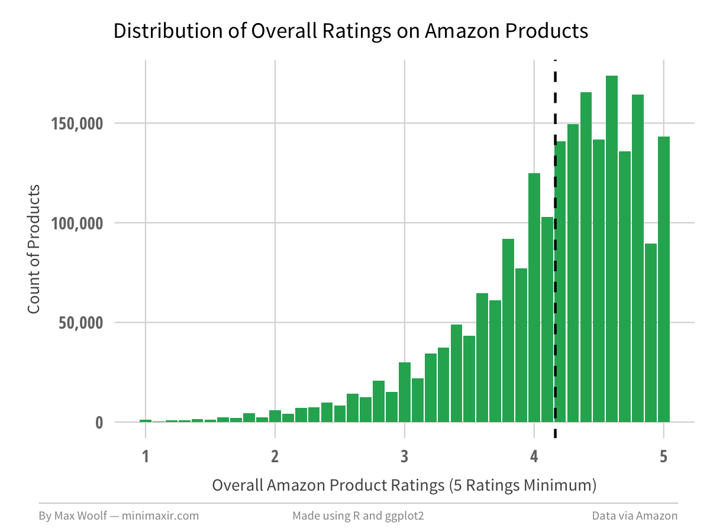

# amazon-spark

R Code + R Notebook for analyzing millions of Amazon reviews using Amazon Spark

This repository is the complement to my blog post [Playing with 80 Million Amazon Product Review Ratings Using Apache Spark](http://minimaxir.com/2017/01/amazon-spark/).

## Maintainer
Max Woolf ([@minimaxir](http://minimaxir.com))

## License
MIT