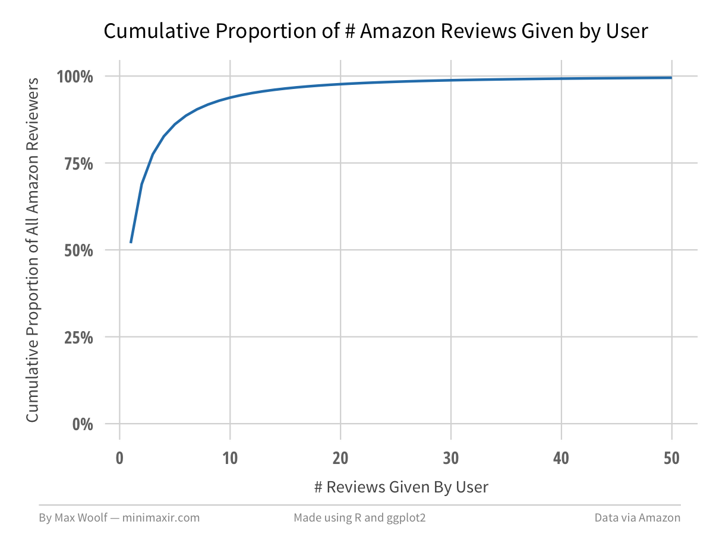
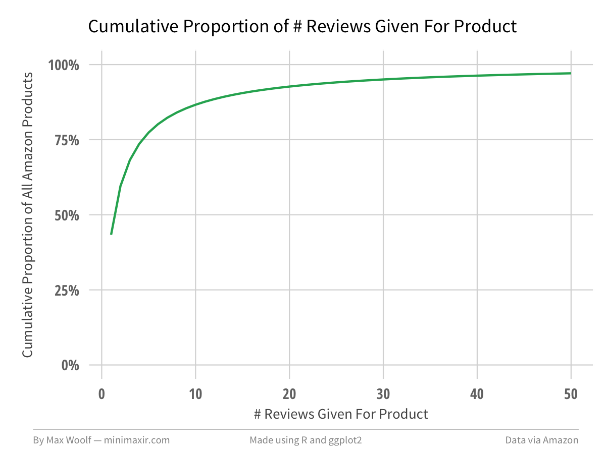
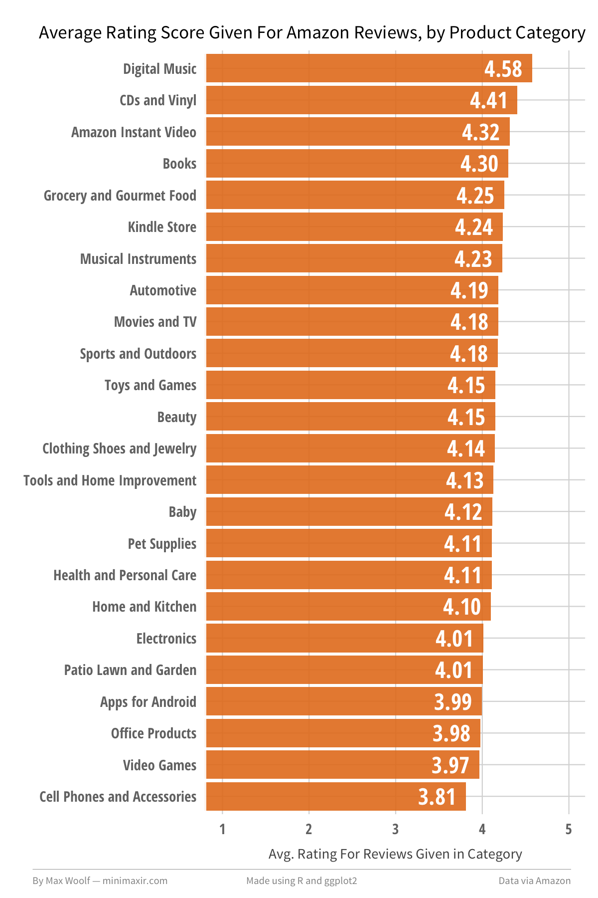
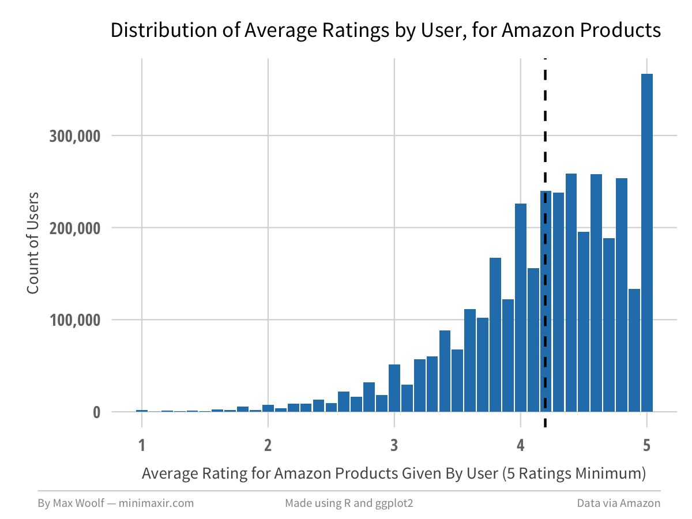
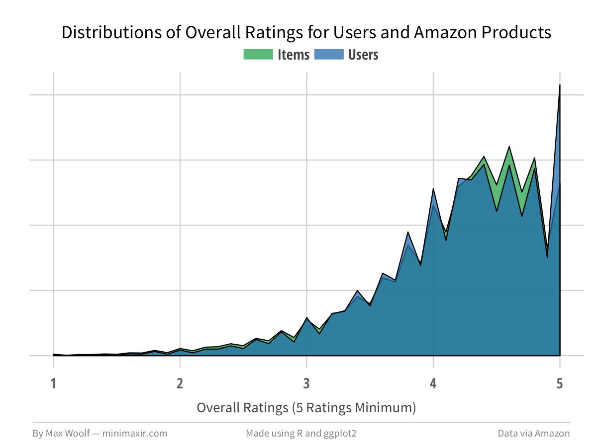
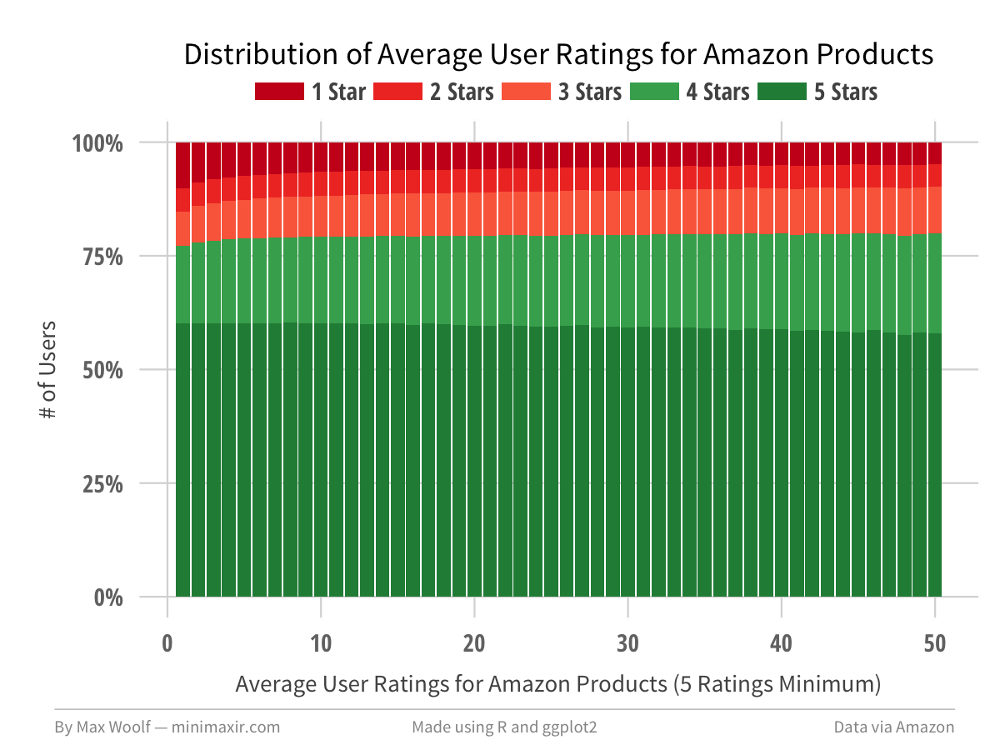
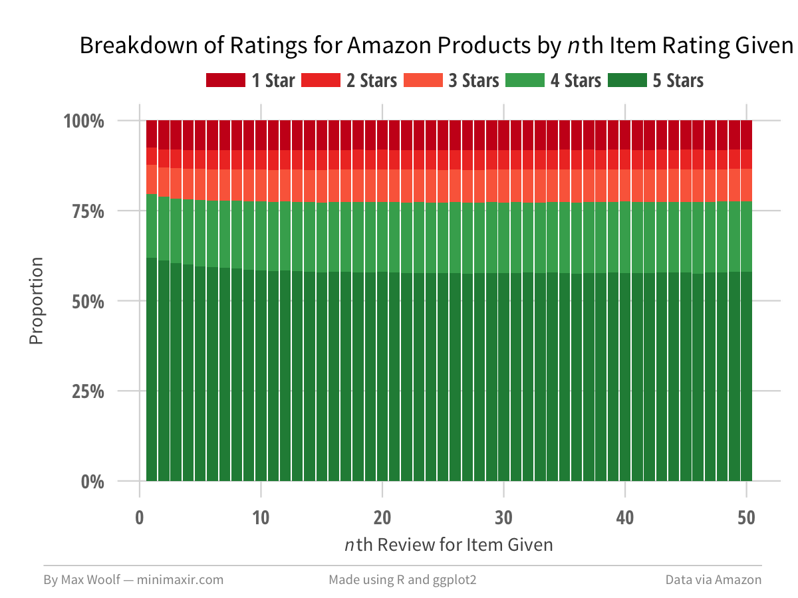
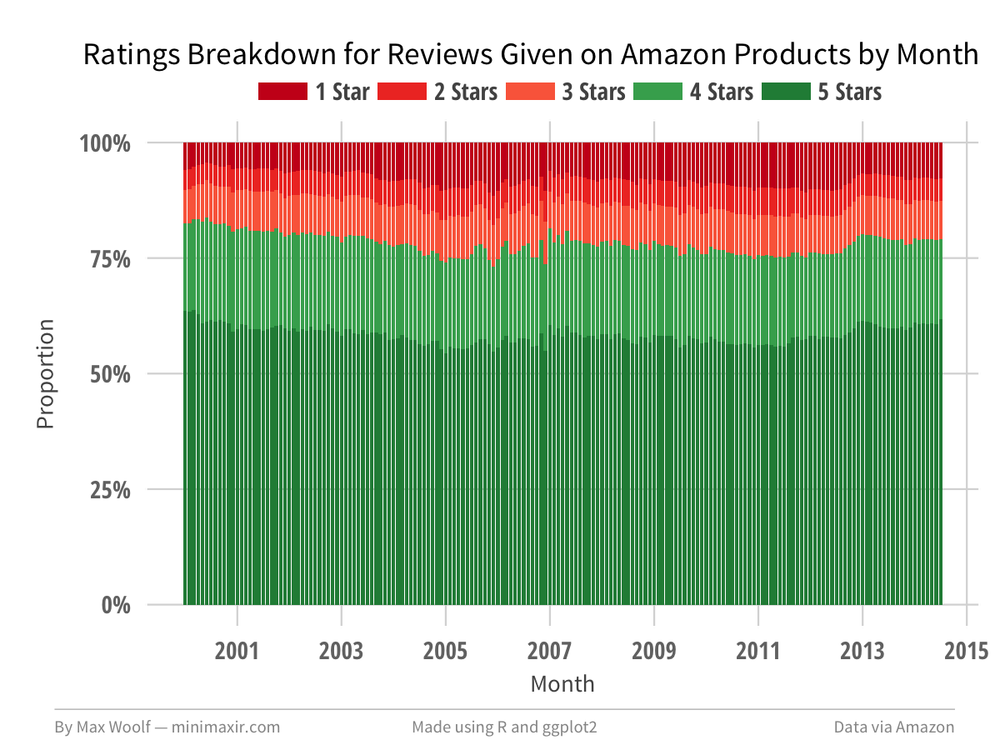
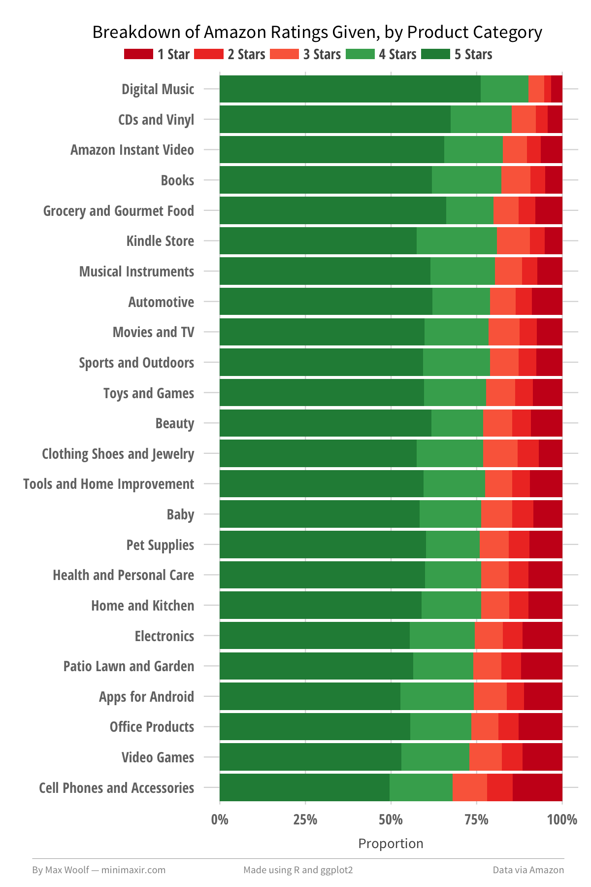

This R Notebook is the complement to my blog post [Playing with 80 Million Amazon Product Review Ratings Using Apache Spark](http://minimaxir.com/2017/01/amazon-spark/).

This notebook is licensed under the MIT License. If you use the code or data visualization designs contained within this notebook, it would be greatly appreciated if proper attribution is given back to this notebook and/or myself. Thanks! :)

# Setup

Setup the R packages.

```{r setup}

library(dplyr)
library(ggplot2)
library(sparklyr)

source("Rstart.R")
```

```{r}
sessionInfo()
```

Note: I added `sparklyr.shell.driver-memory: 8G` to my Spark configuration profile to ensure there is enough memory for the entire dataset to fit in it for a single-client user. (otherwise it will write a LOT of data to disk!)

Usable memory is half the drver memory (since data is replicated 1x), so that config setting will fit 4 GB of data.

I use a 128GB Flash drive for the `spark.local.dir` as a scratch for Shuffle Write when necessary. (note; has 60MB/s write, so it will bottleneck on insane writes). However, it will not destroy valuable SSDs. Comment out the line if that is not an issue.


```{r}
config <- spark_config()
config$`sparklyr.shell.driver-memory` <- "8G"
config$spark.local.dir <- "/Volumes/MAX128GB/tmp"

# Spark 2.1.0 was released but not supported by sparklyr at time of writing
sc <- spark_connect(master = "local", config = config, version="2.0.2")
sc$config
```


```{r}
file_path <- "/Users/maxwoolf/Downloads/amazon_ratings"

# do not cache the initial data set to save memory; only cache the final result

df <- spark_read_csv(sc, 'data', paste(file_path, "amazon_ratings.csv", sep="/"), header=T, overwrite=T, memory=F)

df
```

Dedupe to remove cases where reviews have the same `user_id` and `item_id`.

```{r}
df <- df %>% group_by(user_id, item_id) %>% filter(row_number(item_id) == 1) %>% ungroup()
```

## Additional Attributes

Add columns representing the timestamp as appropriate date/time values.

To convert an <int> timestamp to a <string> represting the timestamp, use `from_unixtime` (via [Stack Overflow](http://stackoverflow.com/a/37569855)). Day of week requires a [special function](http://stackoverflow.com/questions/25006607/how-to-get-day-of-week-in-sparksql).

The time zone is in the time zone of the system running it (in my case, PST [GMT-7]). To compensate, I add an offset of 7+1 hours (due to Daylight Savings Time).

```{r}
hours_offset <- 8

df <- df %>% mutate(timestamp_f = from_unixtime(timestamp + hours_offset*60*60))

df <- df %>% mutate(hour = hour(timestamp_f),
                    dayofweek = date_format(timestamp_f, 'EEEE'),
                    month = month(timestamp_f),
                    year = year(timestamp_f))
```

Append columns corresponding to the fact that a given rating is the user's *n*th rating, and the item's *n*th rating.

Because the timestamps are truncated to Day, ties are possible. If a tie is present, give the ranking the same *n*th value, since it's better than losing date.

```{r}
df <- df %>% group_by(user_id) %>% mutate(user_nth = min_rank(timestamp)) %>% ungroup()

df <- df %>% group_by(item_id) %>% mutate(item_nth = min_rank(timestamp)) %>% ungroup()
```

Register the transformations as a new Spark DataTable and cache the result (since caches are immutable)

```{r}
df_t <- df %>% sdf_register("data_t")
tbl_cache(sc, "data_t")

df_t
```

Verify latter query worked correctly, and table cached correctly, by filtering on specific values. (cache tested by seeing if `sql_render` queries explicitly from `data_t` instead of a temp)

```{r}
sql_render(df_t %>% filter(user_id == "A3BUDYITWUSIS7"))
df_t %>% filter(user_id == "A3BUDYITWUSIS7") %>% collect()
df_t %>% filter(item_id == "0739048287") %>% collect()
```

# Exploratory Analysis

## Authors

Number of Unique authors:

```{r}
df_user_review_counts <- df_t %>%
                          group_by(user_id) %>%
                          summarize(num_reviews=n()) %>%
                          group_by(num_reviews) %>%
                          summarize(total=n()) %>%
                          arrange(num_reviews) %>%
                          collect()

df_user_review_counts %>% head(100)
```

There are **`r df_user_review_counts %>% select(total) %>% sum() %>% format(big.mark=",")`** unique users in this dataset. **`r (df_user_review_counts$total[1] / (df_user_review_counts %>% select(total) %>% sum())) %>% percent()`** have only left one review.

```{r}
df_temp <- df_user_review_counts %>%
              mutate(norm = total/sum(total), prop = cumsum(norm)) %>%
              filter(num_reviews <= 50)

plot <- ggplot(df_temp, aes(x=num_reviews, y=prop)) +
          geom_line(color="#2980b9") +
          fte_theme() +
          scale_y_continuous(labels = percent, limits=c(0,1)) +
          labs(title="Cumulative Proportion of # Amazon Reviews Given by User", x="# Reviews Given By User", y="Cumulative Proportion of All Amazon Reviewers")

max_save(plot, "user_count_cum", "Amazon")
```



```{r}
df_item_review_counts <- df_t %>%
                          group_by(item_id) %>%
                          summarize(num_reviews=n()) %>%
                          group_by(num_reviews) %>%
                          summarize(total=n()) %>%
                          arrange(num_reviews) %>%
                          collect()

df_item_review_counts %>% head(100)
```

There are **`r df_item_review_counts %>% select(total) %>% sum() %>% format(big.mark=",")`** unique items in this dataset.  **`r (df_item_review_counts$total[1] / (df_item_review_counts %>% select(total) %>% sum())) %>% percent()`** have only left one review.

```{r}
df_temp <- df_item_review_counts %>%
              mutate(norm = total/sum(total), prop = cumsum(norm)) %>%
              filter(num_reviews <= 50)

plot <- ggplot(df_temp, aes(x=num_reviews, y=prop)) +
          geom_line(color="#27ae60") +
          fte_theme() +
          scale_y_continuous(labels = percent, limits=c(0,1)) +
          labs(title="Cumulative Proportion of # Reviews Given For Product", x="# Reviews Given For Product", y="Cumulative Proportion of All Amazon Products")

max_save(plot, "item_count_cum", "Amazon")
```



Average item rating by type.

```{r}
df_agg <- df_t %>%
            group_by(category) %>%
            summarize(count = n(), avg_rating = mean(rating)) %>%
            arrange(desc(avg_rating)) %>%
            collect()

df_agg
```

```{r}
df_temp <- df_agg
df_temp$category <- factor(df_temp$category, levels=rev(df_temp$category))

plot <- ggplot(df_temp, aes(x=category, y=avg_rating)) +
          geom_bar(stat="identity", fill="#e67e22", alpha=0.9) +
          geom_text(aes(label=sprintf("%0.2f", avg_rating)), color="white", hjust=1.25, family="Open Sans Condensed Bold") +
          fte_theme() +
          coord_flip() +
          scale_y_continuous(limits = c(1,5), oob = rescale_none) +
   theme(plot.title=element_text(vjust=0, hjust=1), axis.title.y=element_blank()) +
          labs(title="Average Rating Score Given For Amazon Reviews, by Product Category", y="Avg. Rating For Reviews Given in Category")

max_save(plot, "avg_rating_desc", "Amazon", h=6, tall=T)
```



Average rating by *n*th user review.

```{r}
df_agg <- df_t %>%
            filter(user_nth <= 50) %>%
            group_by(user_nth) %>%
            summarize(count=n(), avg_rating = mean(rating)) %>%
            arrange(user_nth) %>%
            collect()

df_agg
```

Average rating by *n*th item review.

```{r}
df_agg <- df_t %>%
            filter(item_nth <= 50) %>%
            group_by(item_nth) %>%
            summarize(count=n(), avg_rating = mean(rating)) %>%
            arrange(item_nth) %>%
            collect()

df_agg
```

Aggregate by Day of Week and Hour. Unfortunately, this confirms that timestamps are truncated to Day, making the Hour useless, and Day of Week, at the least, has no impact on average rating.

```{r}
df_agg <- df_t %>%
            group_by(dayofweek, hour) %>%
            summarize(count=n(), avg_rating = mean(rating)) %>%
            arrange(dayofweek, hour) %>%
            collect()

df_agg
```

## Time

Aggregate by Month and Year .

```{r}
df_agg <- df_t %>%
            group_by(year, month) %>%
            filter(year >= 2000) %>%
            summarize(count=n(), avg_rating = mean(rating)) %>%
            arrange(year, month) %>%
            collect()

df_agg
```

Aggregate by Day of year. Can subset the formatted timestamp since no date column. Remove 1999 and 2014 since partial years.

There appear to be data irregularities causing dates like January 9th to appear, and more aggresive filtering on years changes the order completely. Therefor, this cannot be trusted or used in the post.

```{r}
df_agg <- df_t %>%
            filter(year >= 2000, year < 2014) %>%
            mutate(date = substr(timestamp_f, 6, 5)) %>%
            group_by(date) %>%
            summarize(count=n(), avg_rating = mean(rating)) %>%
            arrange(desc(count)) %>%
            collect() %>%
            mutate(norm = round(count/sum(count), 5))

df_agg
```

# Distributions of Ratings

Histogram of average ratings by users with atleast 5 reviews (rounded to nearest tenth)

```{r}
df_agg_users <- df_t %>%
            group_by(user_id) %>%
            summarize(count=n(), avg_rating = round(mean(rating), 1)) %>%
            filter(count >= 5) %>%
            group_by(avg_rating) %>%
            summarize(count_avg = n()) %>%
            arrange(avg_rating) %>%
            collect()

df_agg_users
```

Get average of averages, on the given filter.

```{r}
agg_users_true <- df_t %>%
            group_by(user_id) %>%
            summarize(count=n(), avg_rating = mean(rating)) %>%
            filter(count >= 5) %>%
            ungroup() %>%
            summarize(avg = mean(avg_rating)) %>%
            collect()

agg_users_true
```


```{r}
plot <- ggplot(df_agg_users, aes(x=avg_rating, y=count_avg)) +
          geom_bar(stat="identity", fill='#2980b9') +
          geom_vline(xintercept=agg_users_true %>% unlist(), linetype="dashed") +
          fte_theme() +
          scale_y_continuous(labels = comma) +
          labs(title="Distribution of Average Ratings by User, for Amazon Products", x="Average Rating for Amazon Products Given By User (5 Ratings Minimum)", y="Count of Users")

max_save(plot, "user_histogram", "Amazon")
```



Histogram of average ratings for products with atleast 5 reviews (rounded to nearest tenth)

```{r}
df_agg_items <- df_t %>%
            group_by(item_id) %>%
            summarize(count=n(), avg_rating = round(mean(rating), 1)) %>%
            filter(count >= 5) %>%
            group_by(avg_rating) %>%
            summarize(count_avg = n()) %>%
            arrange(avg_rating) %>%
            collect()

df_agg_items
```

Get average of averages, on the given filter.

```{r}
agg_items_true <- df_t %>%
            group_by(item_id) %>%
            summarize(count=n(), avg_rating = mean(rating)) %>%
            filter(count >= 5) %>%
            ungroup() %>%
            summarize(avg = mean(avg_rating)) %>%
            collect()

agg_items_true
```

```{r}
plot <- ggplot(df_agg_items, aes(x=avg_rating, y=count_avg)) +
          geom_bar(stat="identity", fill='#27ae60') +
          geom_vline(xintercept=agg_items_true %>% unlist(), linetype="dashed") +
          fte_theme() +
          scale_y_continuous(labels = comma) +
          labs(title="Distribution of Overall Ratings on Amazon Products", x="Overall Amazon Product Rating (5 Ratings Minimum)", y="Count of Products")

max_save(plot, "item_histogram", "Amazon")
```


Merge the 2 charts together in a density plot.

```{r}
temp <- (df_agg_users %>% mutate(category="Users", norm=count_avg/sum(count_avg))) %>% union_all(df_agg_items %>% mutate(category="Items", norm=count_avg/sum(count_avg)))

plot <- ggplot(temp, aes(x=avg_rating, y=norm, fill=category)) +
          geom_density(stat="identity", alpha=0.75, size=0.25) +
          fte_theme() +
          theme(legend.title = element_blank(), legend.position="top", legend.direction="horizontal", legend.key.width=unit(0.5, "cm"), legend.key.height=unit(0.0, "cm"), plot.title=element_text(vjust=0, hjust=0.5), legend.margin=margin(0, 0, -0.2, 0, "cm"), axis.text.y = element_blank(), axis.title.y=element_blank()) +
          scale_fill_manual(values=c('#27ae60', '#2980b9')) +
          labs(title="Distributions of Overall Ratings for Users and Amazon Products", x="Overall Ratings (5 Ratings Minimum)")

max_save(plot, "user_item_histogram", "Amazon")
```



# Rating Breakdown Across *n*th Rating

```{r}
rank_colors = c(brewer.pal(9, "Reds")[c(7,6,5)],brewer.pal(9, "Greens")[c(6,7)])
```


Breakdown accross *n*th user rating.

```{r}
df_breakdown_users <- df_t %>%
            filter(user_nth <= 50) %>%
            group_by(user_nth, rating) %>%
            summarize(count=n()) %>%
            arrange(user_nth, rating) %>%
            collect()

df_breakdown_users %>% head(10)
```

```{r}
plot <- ggplot(df_breakdown_users, aes(x=user_nth, y=count, fill=as.factor(rating))) +
          geom_bar(stat="identity", position = "fill") +
          fte_theme() +
          scale_y_continuous(labels = percent) +
  theme(legend.title = element_blank(), legend.position="top", legend.direction="horizontal", legend.key.width=unit(0.5, "cm"), legend.key.height=unit(0.0, "cm"), plot.title=element_text(vjust=0, hjust=0.5), legend.margin=margin(0, 0, -0.2, 0, "cm")) +
  scale_fill_manual(values=rank_colors, labels = c("1 Star", "2 Stars", "3 Stars", "4 Stars", "5 Stars")) +
          labs(title="Distribution of Average User Ratings for Amazon Products", x="Average User Ratings for Amazon Products (5 Ratings Minimum)", y="# of Users")

max_save(plot, "user_nth_breakdown", "Amazon")
```



Breakdown accross *n*th item rating.

```{r}
df_breakdown_items <- df_t %>%
            filter(item_nth <= 50) %>%
            group_by(item_nth, rating) %>%
            summarize(count=n()) %>%
            arrange(item_nth, rating) %>%
            collect()

df_breakdown_items %>% head(10)
```

```{r}
plot <- ggplot(df_breakdown_items, aes(x=item_nth, y=count, fill=as.factor(rating))) +
          geom_bar(stat="identity", position = "fill") +
          fte_theme() +
          scale_y_continuous(labels = percent) +
  theme(legend.title = element_blank(), legend.position="top", legend.direction="horizontal", legend.key.width=unit(0.5, "cm"), legend.key.height=unit(0.0, "cm"), plot.title=element_text(vjust=0, hjust=0.75), legend.margin=margin(0, 0, -0.2, 0, "cm")) +
  scale_fill_manual(values=rank_colors, labels = c("1 Star", "2 Stars", "3 Stars", "4 Stars", "5 Stars")) +
          labs(title=expression(paste("Breakdown of Ratings for Amazon Products by ", italic("n"), "th Item Rating Given")), x=expression(paste(italic("n"), "th Review for Item Given")), y="Proportion")

max_save(plot, "item_nth_breakdown", "Amazon")
```



Breakdown over time.

```{r}
df_breakdown_time <- df_t %>%
            filter(year >= 2000) %>%
            group_by(year, month, rating) %>%
            summarize(count=n()) %>%
            arrange(year, month, rating) %>%
            collect() %>%
            mutate(date = as.Date(paste(year, month, "01", sep='-')))

df_breakdown_time %>% head(10)
```

```{r}
plot <- ggplot(df_breakdown_time, aes(x=date, y=count, fill=as.factor(rating))) +
          geom_bar(stat="identity", position = "fill") +
          fte_theme() +
          scale_x_date(breaks=date_breaks('2 years'), date_labels = "%Y") +
          scale_y_continuous(labels = percent) +
  theme(legend.title = element_blank(), legend.position="top", legend.direction="horizontal", legend.key.width=unit(0.5, "cm"), legend.key.height=unit(0.0, "cm"), plot.title=element_text(vjust=0, hjust=1), legend.margin=margin(0, 0, -0.2, 0, "cm")) +
  scale_fill_manual(values=rank_colors, labels = c("1 Star", "2 Stars", "3 Stars", "4 Stars", "5 Stars")) +
          labs(title="Ratings Breakdown for Reviews Given on Amazon Products by Month", x="Month", y="Proportion")

max_save(plot, "time_breakdown", "Amazon")
```



Breakdown by Category (tricker to plot). Also include averages.

```{r}
df_breakdown_category <- df_t %>%
            group_by(category, rating) %>%
            summarize(count=n()) %>%
            arrange(category, rating) %>%
            collect()

df_breakdown_category %>% head(10)

df_breakdown_category_avg  <- df_t %>%
            group_by(category) %>%
            summarize(avg_rating = mean(rating), sd_mean = sd(rating)/sqrt(n())) %>%
            arrange(desc(avg_rating)) %>%
            collect()

df_breakdown_category_avg
```

```{r}
df_breakdown_category$category <- factor(df_breakdown_category$category, levels=rev(df_breakdown_category_avg$category))

plot <- ggplot(df_breakdown_category, aes(x=category, y=count, fill=as.factor(rating))) +
          geom_bar(stat="identity", position = "fill") +
          fte_theme() +
          coord_flip() +
          scale_y_continuous(labels = percent) +
  theme(legend.title = element_blank(), legend.position="top", legend.direction="horizontal", legend.key.width=unit(0.5, "cm"), legend.key.height=unit(0.0, "cm"), plot.title=element_text(vjust=0, hjust=1.5), legend.margin=margin(0, 0, -0.2, -3, "cm"), axis.title.y=element_blank()) +
  scale_fill_manual(values=rank_colors, labels = c("1 Star", "2 Stars", "3 Stars", "4 Stars", "5 Stars")) +
          labs(title="Breakdown of Amazon Ratings Given, by Product Category", y="Proportion")

max_save(plot, "category_breakdown", "Amazon", h=6, tall=T)
```



# Code Which Did Not Work Out

## RAMdisk

Create a 4GB RAMdisk (on OSX) for fastest writes during shuffles / spare the life of the SSDs.

Removed because Spark wants *much* more than 4GB! (final dataset required 12GB scratch)

```{r, eval=FALSE}
ram_size_GB <- 4

system("diskutil unmount /Volumes/RAMdisk")
system(sprintf("diskutil erasevolume HFS+ 'RAMdisk' `hdiutil attach -nomount ram://%s`", ram_size_GB * 1024 * 2048))
```

## Alternate Method of Reading Files into Spark

This method loads files into Spark without the Python preprocessing script, but due to how Spark works (has to repartition everytime a dataset is), it results in a lot of unnecessary disk activity (~50GB written!) since a shuffle write occurs for *each* concatenated dataset.

```{r, eval=FALSE}
file_path <- "/Users/maxwoolf/Downloads/amazon_ratings"

files <- list.files(file_path)
files
```

```{r, eval=FALSE}
extract_name <- function(x) {gsub("_", " ", substring(x, 9, nchar(x)-4))}
extract_name("ratings_Amazon_Instant_Video.csv")
```

Combine the dataframes together. Additionally, add a column representing the category of data the rating is from.

* Read the data for a base table
* To add the categories correctly, the evaluation must be nonlazy: use `sdf_mutate()` to force evaluation.
* Read another table into a temp table, concatenate it to the normal data table, repeat.

```{r, eval=FALSE}
clean_name <- extract_name(files[1])
df <- spark_read_csv(sc, 'load', paste(file_path, files[1], sep="/"), header=F, overwrite=T) %>%
    mutate(category = clean_name)%>%
    sdf_mutate()

for (file in files[-1]) {
  clean_name <- extract_name(file)
  temp <- spark_read_csv(sc, 'temp', paste(file_path, file, sep="/"), header=F, overwrite=T) %>%
    mutate(category = clean_name) %>%
    sdf_mutate()
  
  temp
  
  df <- df %>% union(temp)
  
  df
}


df <- df %>%
  rename(user_id = V1, item_id = V2, rating = V3, timestamp = V4) %>%
  sdf_register("data")

# cache table *before* calling it so latter call is free.
tbl_cache(sc, "data")
df 

# remove tables which no longer need to be used
tbl_uncache(sc, "load")
tbl_uncache(sc, "temp")
```

## Dedupe (on Timestamp)

This was a dedupe to remove cases where reviews by a person had the same timestamp; the true cause of that behavior was the Day truncation of the timestamp.

```{r, eval=FALSE}
df <- df %>% group_by(user_id, timestamp) %>% filter(row_number(timestamp) == 1) %>% ungroup()
```

# LICENSE

The MIT License (MIT)

Copyright (c) 2017 Max Woolf

Permission is hereby granted, free of charge, to any person obtaining a copy of this software and associated documentation files (the "Software"), to deal in the Software without restriction, including without limitation the rights to use, copy, modify, merge, publish, distribute, sublicense, and/or sell copies of the Software, and to permit persons to whom the Software is furnished to do so, subject to the following conditions:

The above copyright notice and this permission notice shall be included in all copies or substantial portions of the Software.

THE SOFTWARE IS PROVIDED "AS IS", WITHOUT WARRANTY OF ANY KIND, EXPRESS OR IMPLIED, INCLUDING BUT NOT LIMITED TO THE WARRANTIES OF MERCHANTABILITY, FITNESS FOR A PARTICULAR PURPOSE AND NONINFRINGEMENT. IN NO EVENT SHALL THE AUTHORS OR COPYRIGHT HOLDERS BE LIABLE FOR ANY CLAIM, DAMAGES OR OTHER LIABILITY, WHETHER IN AN ACTION OF CONTRACT, TORT OR OTHERWISE, ARISING FROM, OUT OF OR IN CONNECTION WITH THE SOFTWARE OR THE USE OR OTHER DEALINGS IN THE SOFTWARE.